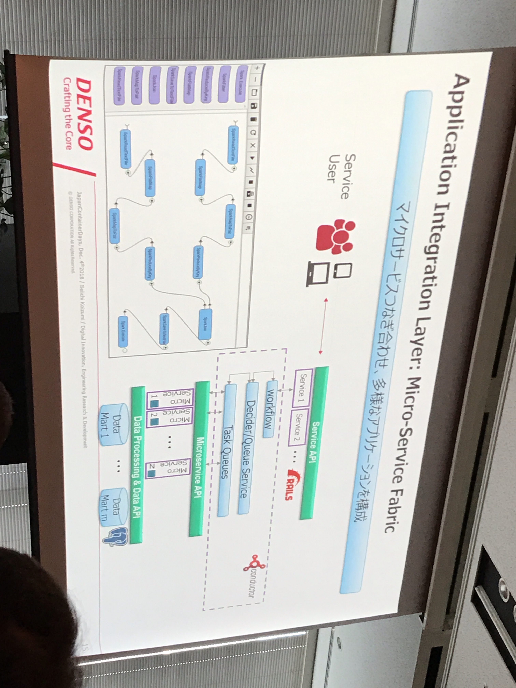
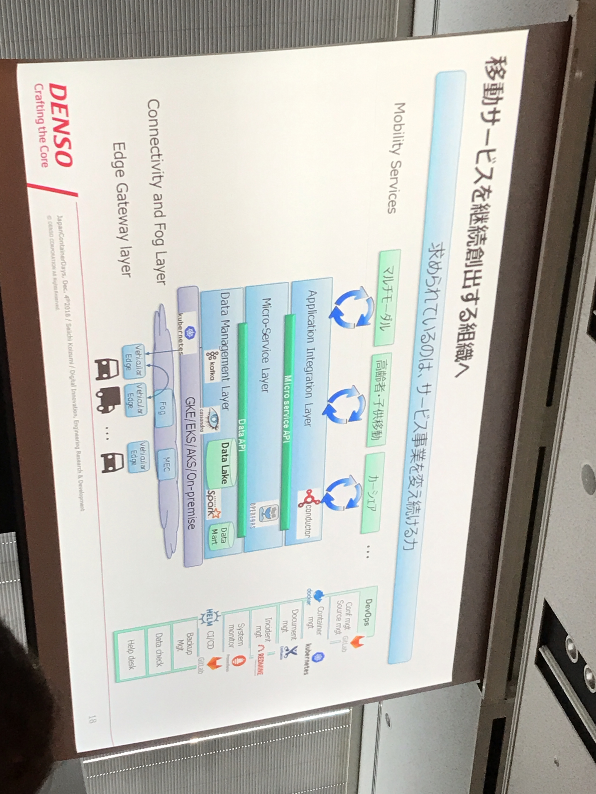

# JKD Day1

## keynote

### Mercari
- Continuous Delivery
- Immutable Infrastructure 
- Deterministic Deployment
- Why Container -> Faster build & boot / High Portability / Better utilization 
- Why Kubernetes -> Extensibility / Ecosystem
- Contribute to Ecosystem

### PFN
- k8s が PFN の機械学習基盤の要件をカバー
- 優先度で重みをつけてプリエンプション
- GPU を手軽に使えるように
- 特定のツールに縛られない（Jupyter Hub や kubectl exec など）

### LINE
- Verda = LINE Private Cloud = IaaS + Middleware +  CaaS
- PaaS を開発し、全てに適用されるはずだったが限界があった
    - 複数のコンテナ
    - 大量のバッチジョブ
    - etc...
- KaaS の必要性が高まる
    - 野良 k8s では HA などの課題を全て保証するのが難しい
    - 知見の共有？など
    - Rancher 2.X をベースに開発
- FaaS も開発中
    - Event Driven
    - 運用自動化、Bot、Webhook 用の API
    - Knative + α で実現
- 開発者のニーズに応じた適切なサービスレベルで提供する
    - CaaS = KaaS + PaaS + FaaS

### IBM
- Cloud Native、スピードと柔軟性
- Watson を k8s 化して他社クラウドやオンプレでも動かせるようにした
- k8s クラスタを分離、分散させていく
    - クラスタ数増大
        - 継続的に運用可能か？
        - スーパーエンジニアに依存
    - 対応策
        - マネージドサービスの利用
        - スーパーエンジニアを育てる
        - マルチクラウド／ハイブリッドクラウドで運用

### DENSO
- IoT
- Message broker (kafka) -> Data Lake (cassandra) -> Data Processing (Spark)
- Ruby/Python/Jupyter -> GitLab -> OpenFaaS

### ZOZO
- 既存システムを k8s でリプレイス
- Azure  を選択
  - オンプレで MS を使っていた
  - ACS/AKS ではなく ACS Engine  を使用
  - 初めて使う場合は AKS がおススメ
- Kubernetes
  - Namespace
  - セルフヒーリング
  - 水平podスケーリング
  - など
- 基本的な説明がほとんど

### Organizer
- CloudNativeDays にリブランド	
    - July 22-23 Tokyo

## IBM Kubernetes の全貌と始め方

## 本番環境の Kubernetes マニフェストに最低限必要な7のこと
- ライフサイクル（初期化）
    - Entrypoint
    - Init Container を利用
    - Sidecar pattern
    - PostStart scripts
- ライフサイクル（停止時）
    - spec.restartPolicy -> Deployment を使う限り Always がほとんど
    - コンテナ停止時の挙動を理解する方が大事
- ヘルスチェック
    - ReadinessProbe / LivenessProbe
- メンテナンスとアップデート
- スケジューリング
    - いろいろな方式がある
- リソースの割り当て
    - Limits: リソースの使用上限
    - Requests: リソースの使用下限
        - 実際にはそこまで使わないこともあるので「高すぎる」とダメ
        - 「低すぎる」と実際の負荷が高いのにスケジューリングされたりする
    - Limits / Requests の差がなるべく開かないようにする
        - 同じ値にする戦略もある
    - LimitRange による問題の抑止
- カーネルパラメータの変更
- インターネットに公開するサービスのアクセス制限
    - ロードバランサでアクセス制御
    - Network Policy での制限
    - Ingress での制限

## 一人でできる Docker/Kubernetes 開発
- 新規サービス立ち上げあるある
    - 人がいない
    - 時間がない
- Docker/Kubernetes の導入
    - Docker
        - サービスの振る舞いに必要なものは Docker イメージに入れる
            - 開発言語、ライブラリなど
        - 全ての環境で同じ実行経路を通る
            - 環境の差は設定によって表現
            - 設定ファイル、環境変数の使い分け
        - Google Container Registry
        - GitHub > CircleCI > Cloud Source Repositories > Cloud Build > Container Registry
    - Kubernetes
        - GKE を採用
        - 設定の差分をどうするか
            - kustomize
        - Graceful shutdown
        - Rolling update
        - GCP の IAM のみで権限管理
            - 検証と本番では GCP プロジェクトを分ける
        - Cloud SQL の Private IP 対応があった
            - CloudSQLProxy の SideCar コンテナを排除できる
        - Web コンソールで kubectl 使えてしまうので排除
        - DB スキーマを適用するコマンド実行を行う Pod を用意
            - Job ではなく Deployment にした
        - ログは stackdriver > export > pub/sub > dataflow > bq
        - 環境構築は現状手動
        - ローカルで k8s は立ち上げない
            - さくっと検証環境にデプロイしている
        - 負荷試験
            - 簡単なシナリオを使って10倍のリクエストを投げてテスト
    - Docker イメージの Kubernetes への反映
        - kubectl をラップしたコマンドでいろいろやって反映

## CKA/CKAD
- クラウドネイティブに必要な技術
    - 監視、ログ、ソフトウェア配布、サービスメッシュ、ディスカバリー、ネットワーキング、分散ストレージ etc...
- Kubernetes 始めるために
    - 英語、Go
    - 目的の整理。。。
    - 青山本
    - とにかく手を動かす
    - yaml 地獄を味わう
    - 内部コンポーネントの理解
    - 環境構築
        - マネージドサービス
        - 自前で構築
    - k8s だけで全ては解決しない

## Kubernetes が超強力な分散 RDB に。Vitess の真価を大検証してみた。
- Vitess の特徴
    - パフォーマンスが良い
    - k8s じゃなくても動くが今回は k8s 上で動かす
    - MySQL クライアントからそのまま利用可能（一部非互換あり）
- アーキテクチャ
    - VTGate / Topology(etcd) / tablet = VTtablet + mysqld / VTctld / VTctl
- Vitess in Kubernetes
    - 各要素は pod / service となる
- gRPC のコネクタと従来の MySQL クライアントをサポート
- シャーディングの仕組み
    - Vertival / Horizontal
    - VIndex??
- 負荷分散による性能向上
    - 分散クエリー
    - client > VTGate > VTtablet > mysqld
    - 4倍近く向上
- スケーラビリティでトランザクション処理の向上
    - sysbench 1.0.15 で負荷試験
- 必要なスキルセット
    - スキーマ設計
    - MySQLスキル
    - k8s
    - Go
    - 諦めない心
- Oracle Container Engine ではなく GKE を使って検証した